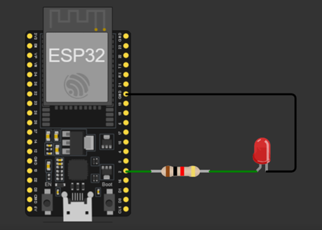

## Atividade prática 1
* Desenvolver um programa para fazer um led piscar(o famoso blink). O led deve ficar aceso por 1 segundo e apagado por 1 segundo.

* Pode ser utilizado o próprio led que já vem no kit de desenvolvimento ou, no caso de não haver led no kit, pode ser adicionado um led por fora, numa protoboard, utilizando um resistor de 1K em série com ele.

O circuito deve ser como a imagem abaixo.

