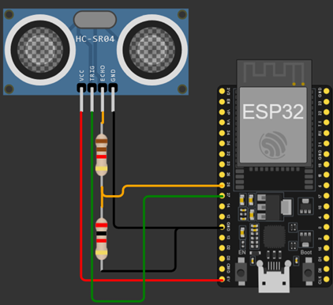

## Atividade Prática 2
* Utilizar um sensor de ultrassom HC-SR04, desenvolver um programa que determine a distância de um objeto colocado a frente desse sensor.

* A distância máxima de detecção deve ser de 400 cm (o sensor, segundo seu datasheet, trabalha no range de 2 cm a 400 cm). Ou seja, além dessa distância, o sensor deverá retornar 0. Essa distância deve poder ser alterada via código (para menos).

* O programa deverá informar a distância através de sua porta serial textualmente. Ex.: "Distância: 30 cm".

O circuito deve ser como o da imagem abaixo.

O funcionamento e o código podem ser vistos no [wokwi](https://wokwi.com/projects/439938918030644225)